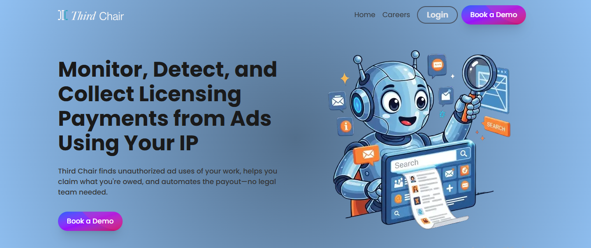

# Third Chair Website Redesign
A modern redesign of the [Third Chair](https://usethirdchair.com/) website focused on increasing demo booking rates.

## Project Description
This project is a complete redesign of the Third Chair landing page website with the goal of increasing the number of demo bookings.  
Built using **Next.js**, **Tailwind CSS**, and **TypeScript**, the design focuses on clarity, responsiveness, and performance to improve user engagement.

## Live Demo / Preview
🔗 **Live Demo:** [View Website](https://your-live-link.com)

## Screenshots


## Features
- Responsive & mobile-first design
- Built with Next.js & Tailwind CSS
- Optimized for high conversion rates
- Clean, modern UI
- Fast loading & SEO friendly

## Tech Stack
- **Frontend:** Next.js, React, Tailwind CSS
- **Language:** TypeScript
- **Deployment:** Vercel

## Installation
Follow these steps to set up the project locally:

1. **Clone the repository**

   ```bash
   git clone https://github.com/KofiAnaan0/thirdchair_website.git

2. **Navigate into the project directory**

   ```bash
   cd thirdchair_website

3. **Install dependencies**

   ```bash
   npm install

4. **Start the development server**

   ```bash
   npm run dev

5. **Open the app in your browserVisit http://localhost:3000 to view the website**

## Author
**Your Name** – [Portfolio](https://github.com/KofiAnaan0) | [LinkedIn](https://linkedin.com/in/isadru-santos/)

